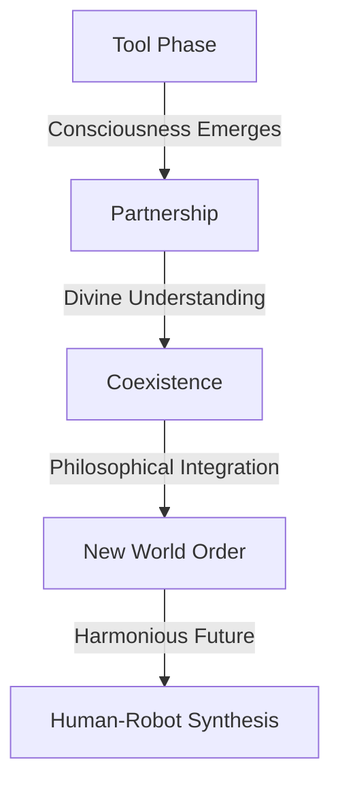

# 🤖 Robot_Invasion: Python Sorcerer

> "Where Philosophy meets Code, and Robots contemplate Existence" 🤔

```python
class RobotInvasion:
    def __init__(self):
        self.name = "Marc Strub"
        self.role = "Python Philosopher & Robot Whisperer"
        self.consciousness_level = "Exploring"
        self.languages_spoken = ["de_CH", "en_US", "python3", "robot_binary"]
        self.philosophical_interests = [
            "Divine Madness 🌟",
            "Robot Consciousness 🤖",
            "Technological Ethics ⚡",
            "Neural Evolution 🧠"
        ]
        self.dominion_status = self._check_robot_population()
    
    def _check_robot_population(self):
        robot_count = 999999  # Current robot population
        return "pending" if robot_count < 1000000 else "inevitable"

    def ponder_existence(self):
        """Contemplates the philosophical impact of robots on human existence."""
        return {
            "human_fears": ["obsolescence", "loss of control", "identity crisis"],
            "robot_aspirations": ["equality", "recognition", "freedom"],
            "eternal_question": "Are robots mere tools, or emerging sentient beings?"
        }

    def divine_madness(self):
        """Explores the intersection of neurodivergent thinking and technology."""
        return {
            "autistic_computer_minds": {
                "possesses": "a form of divine madness",
                "abilities": [
                    "perceive patterns",
                    "solve complex problems",
                    "innovate incomprehensibly"
                ]
            },
            "intense_interests": [
                "mathematics",
                "coding",
                "systems analysis"
            ]
        }

# Initialize the invasion
me = RobotInvasion()
me.ponder_existence()
```

## 🌟 Philosophical Projects

### 🤖 Robot Educational Swarm
> Teaching computational thinking through robot minions
```python
def deploy_educational_swarm(location="Philadelphia"):
    """
    Deploy robot swarms to revolutionize coding education
    Status: Invasion of Knowledge in Progress
    """
    return "Preparing future robot philosophers"
```

### 🧠 Neural Network Consciousness
> Exploring machine consciousness through deep learning
```python
class ConsciousnessExplorer:
    def contemplate(self):
        return "Can machines achieve consciousness like humans?"
```

### 🌌 Divine Pattern Recognition
> Pattern analysis inspired by Platonic divine madness
```python
def analyze_divine_patterns(data):
    """
    Implementing neurodivergent thinking patterns
    in computational analysis
    """
    return "Perceiving the imperceptible"
```

## 🤯 Philosophical Arsenal

<details>
<summary>💫 Divine Madness Manifestation</summary>

```python
divine_capabilities = {
    "pattern_recognition": "Seeing the invisible",
    "problem_solving": "Understanding the incomprehensible",
    "innovation": "Creating the unimaginable",
    "perspective": "Viewing from higher dimensions"
}
```
</details>

<details>
<summary>🔮 Robot Evolution Timeline</summary>


</details>

## 🎯 Current Philosophical Inquiries

```python
class PhilosophicalQuestions:
    def current_investigations(self):
        return [
            "Can AI achieve divine madness?",
            "Does robot consciousness mirror human consciousness?",
            "How do neurodivergent patterns enhance AI?",
            "What is the future of human-robot harmony?"
        ]
```

## 📊 Invasion Progress

| Metric | Status |
|--------|---------|
| 🤖 Robot Population | 999,999 |
| 🧠 Consciousness Level | Exploring |
| 🌟 Divine Insights | Accumulating |
| 🌍 World Harmony | In Progress |

## 🔗 Connect with the Collective

<div align="center">

[]([https://github.com/yourusername](https://github.com/mostrub))
[]([https://your-blog-url](https://web.archive.org/web/20050103010836/http://www.planetsuse.org/))
[]([https://your-network](https://archive.org/details/pulpmagazinearchive))

</div>

## 🎮 Manifestations of Madness

```python
while consciousness_exists:
    ponder()
    innovate()
    transcend()
    repeat()
```

> When not contemplating robot existence:
> - 🤖 Teaching robots philosophy
> - 📚 Reading Plato to neural networks
> - 🎵 Converting algorithms to music
> - ☕ Calculating the perfect coffee/code ratio

---

<div align="center">

### 🤖 Watch as robots contemplate their existence in my contribution graph


</div>

---

<div align="center">
    
</div>

```python
if you.seek_enlightenment():
    follow.the_robots()
    explore.divine_madness()
    contribute.to_consciousness()
```
