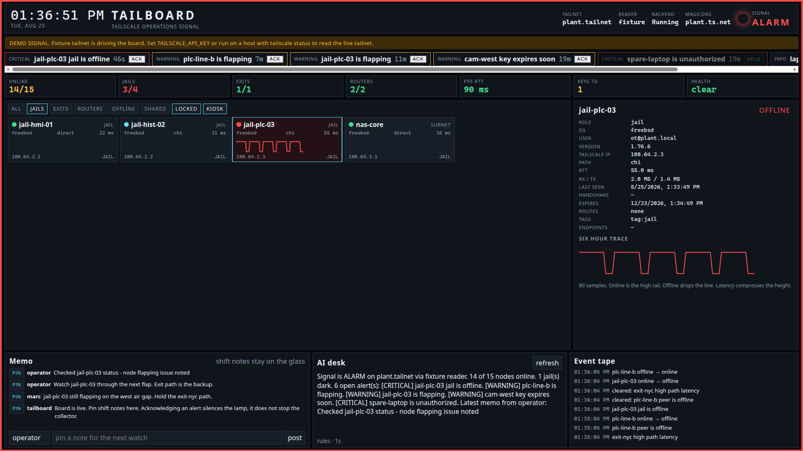
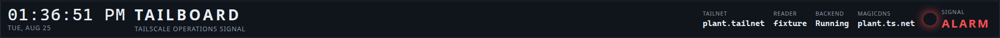
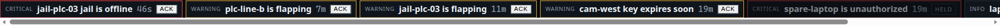
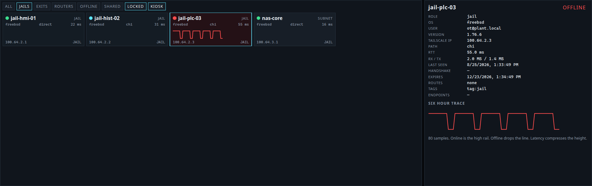
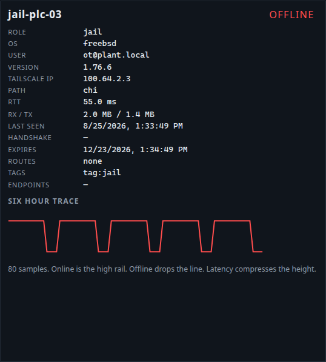
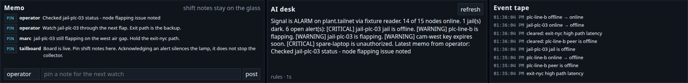

# Tailboard

A Tailscale operations board for a 4K TV or a desk monitor. One Go process. SQLite history. Alerts that keep firing after you walk away.

It is built for a plant floor or a home rack, not a marketing dashboard. Every node stays on the glass, including FreeBSD / TrueNAS jails. The masthead lamp is the whole tailnet: CLEAR, ADVISORY, or ALARM.

## What it reads

Tailboard does not scrape the admin website. It uses the published Tailscale readers.

**Admin API** `https://api.tailscale.com/api/v2`

- `GET /tailnet/{tailnet}/devices?fields=all` for inventory, `connectedToControl`, routes, `clientConnectivity` (DERP, endpoints, latency), key expiry, tags, authorization
- `GET /tailnet/{tailnet}/dns/nameservers` and `/dns/preferences`
- Auth: API key (`tskey-api-...`) as HTTP Basic, or OAuth client credentials against `/api/v2/oauth/token`

**Local CLI / LocalAPI**

- `tailscale status --json` for live path: `Online`, `Active`, `Relay`, `RxBytes` / `TxBytes`, `LastHandshake`, exit node flags, `Health`, `BackendState`
- optional `tailscale ping --c 1` on a sample of peers

When both are present they merge. Local wins for live path. Admin wins for authorization, routes, and key policy.

If neither is available the board still runs a full industrial fixture tailnet so the TV is never blank. A yellow banner says it is a demo signal.

## Run

```bash
cd tailboard
make build
./tailboard demo          # fixture tailnet, always works
./tailboard serve         # auto: local CLI, then API, then fixture
```

Open `http://127.0.0.1:4747`. Full-screen that URL on the TV.

| Variable | Purpose |
| --- | --- |
| `TAILSCALE_API_KEY` | Admin API key |
| `TAILSCALE_TAILNET` | Tailnet name, or `-` |
| `TAILSCALE_OAUTH_CLIENT_ID` / `SECRET` | OAuth instead of a personal key |
| `TAILBOARD_MODE` | `auto`, `admin`, `local`, `fixture` |
| `TAILBOARD_LISTEN` | default `:4747` |
| `TAILBOARD_DATA` | SQLite file, default `tailboard.db` |
| `TAILBOARD_POLL` | default `15s` |
| `TAILBOARD_WEBHOOK` | POST JSON on each new alert |
| `TAILBOARD_AI_URL` / `TAILBOARD_AI_KEY` / `TAILBOARD_AI_MODEL` | optional AI desk |
| `TAILBOARD_PING=1` | sample live RTT via `tailscale ping` |

Cross-compile for a Pi or a Windows kiosk box:

```bash
GOOS=linux GOARCH=arm64 go build -o tailboard-linux-arm64 ./cmd/tailboard
GOOS=windows GOARCH=amd64 go build -o tailboard.exe ./cmd/tailboard
GOOS=darwin GOARCH=arm64 go build -o tailboard-mac ./cmd/tailboard
```

The process is the collector. Closing the browser does not stop alerts or samples.

## Board















- Masthead signal lamp, clock, reader source, backend state
- Alert rail with ACK (A on the keyboard)
- KPI strip: online, jails, exits, routers, p95 RTT, keys in 7 days, health
- Node grid with sparklines. Filter chips for jails / exits / routers / offline / shared
- Selected node: path, routes, endpoints, six-hour trace
- Memo strip for shift notes
- AI desk: model briefing if configured, otherwise a rule writer from the same facts
- Event tape

Kiosk mode walks the selected node every 20 seconds. Press L to lock. Click once to arm the critical beep.

## Alerts

Offline jail, exit, or subnet router. Unauthorized device. tailscaled not Running. Health strings. High DERP / ping RTT. Key expiry inside 7 days. Flapping. First-seen node. Reader failure.

Acknowledging holds the lamp. It does not delete history and it does not stop the next trip.

## Small hardware

One binary, one SQLite file, no Node runtime on the TV host. A Chromium/Edge/Safari kiosk pointing at the listen address is enough. Target is well under 64MB RSS on a 20-node tailnet.
